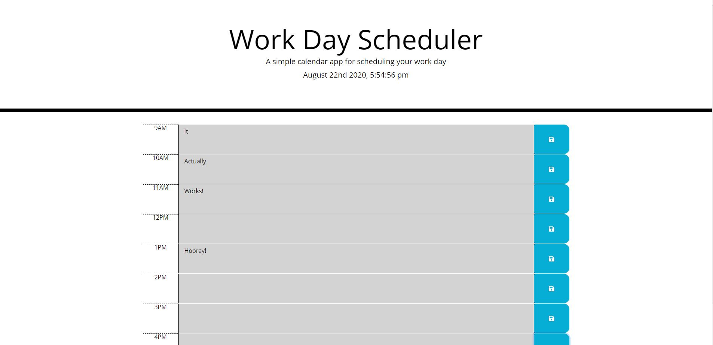

# Work Day Scheduler

Work Day Scheduler is a repository where I used a CSS, HTML, Javascript (jQuery), and a third-party API (moment.js) to create a planner for your 9AM-5PM activities. 

Moment.js was used and can be found [here](https://momentjs.com/)

[Work Day Scheduler](https://slothings.github.io/work-day-scheduler/) is hosted on GitHub Pages

This application was authored by [Seth Martineau](https://github.com/slothings)